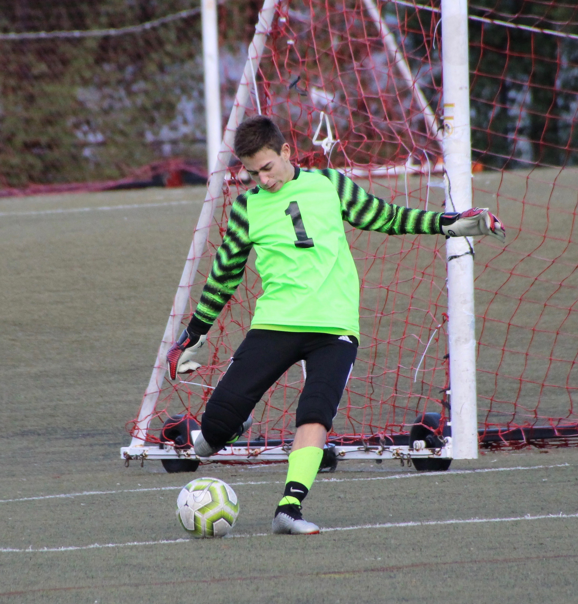

Hi! I'm Jake Federman, and I'm a senior at Horace Mann School in Bronx, NY. This website will serve as a space for me to display my work from my [Art of Data course](https://hm-mrlee.github.io/artofdata/). When I'm in college, or after I graduate, I may continue to use this site as a personal/profile/resume website. If I end up doing that, I will move all the Art of Data work to a single tab.

## Computer Science and Mathematics Experience

Math has always been both my favorite and best subject. Throughout middle and high school, I have been a year ahead in math, and I have been taking courses with older students. Last year, I took AP Calculus AB, and this year, I am taking AP Statistics. In addition, I have been participating in math contests as part of my schools' math team since I was in elementary school, and I currently am the Archivist of the Horace Mann Math Team.

I also have lots of experience in the field of statistics, particularly within the world of sports. During the summer after 10th grade, I attended Wharton Moneyball Academy, where I learned advanced statistics and programming through sports. Last summer, I interned with the Samford University Center for Sports Analytics, where I assisted my supervisor in data collection and analysis, and wrote articles for the Center's [blog](https://www.samford.edu/sports-analytics/fans/2020/Analysis-Which-Power-5-College-Basketball-Conference-Has-the-Strongest-Home-Court-Advantage). In addition, I have my own sports statistics [blog](https://medium.com/@jake_federman), attended sports statistics conferences, and placed in a [sports datathon](http://www.msjdatathon.com).

Finally, I have taken both Comp Sci 1 and Comp Sci 2 at Horace Mann prior to Art of Data, and through the latter course, I learned Java and Greenfoot. I am also comfortable using the languages R and SQL.

Since statistics and data science is my primary academic interest, I plan on majoring in the subject in college. I aspire to work in the analytics department for a professional sports team following graduation.

## Other Interests

I am on both varsity soccer and tennis at Horace Mann. I have been playing these sports since I was 4 years old, and I'm very sad that this year will be my last playing competitively, as I am not planning on playing in college.

## Goals for Art of Data this year

I am super excited about this course! I am particularly excited to learn python, as I have heard it is much simpler yet more powerful than R, and it is an extremely important skill for data scientists. Additionally, Mr. Lee is a great teacher, and I'm happy that I'm in his class once again.