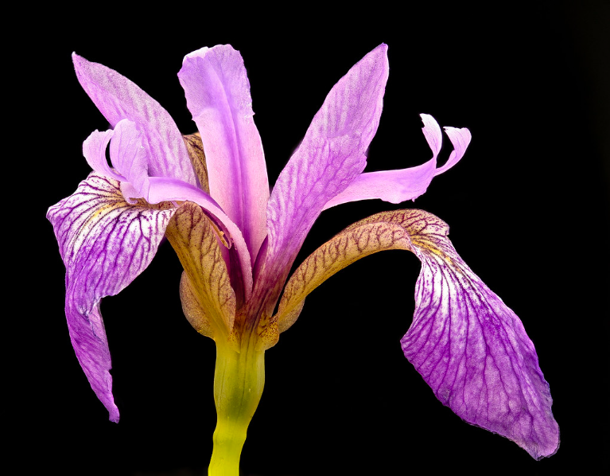

For centuries, the Iris has been regarded as one of the world's most precious flowers. [Symbolizing royalty and power](https://www.flowershopnetwork.com/blog/10-weird-facts-about-irises/), the violet flower is the [state flower of Tennessee](https://sos.tn.gov/products/state-flowers) and was the subject of several [Vincent Van Gogh masterpieces](https://www.metmuseum.org/art/collection/search/436528). However, the numbers behind the Iris that make it so unique remain a mystery. Here, I will examine three popular types of Irises, Iris Setosa, Iris Virginica, and Iris Versicolor, and discuss their measurements.

## Dataset

For my study, I used the UC Irvine iris dataset, accessible [here](https://archive.ics.uci.edu/ml/datasets/Iris). The dataset contains information about the sepal length and width as well as the petal length and width of 150 Irises, including 50 Iris Setosas, 50 Iris Virginicas, and 50 Iris Versicolors.

## Preparing the data

Before I began analyzing the data, I organized it neatly so the analysis could go more smoothly. Before I loaded in the data, I created an empty dictionary called *Sepal_width*, and three empty lists called *Iris_setosa_width*, *Iris_virginica_width*, and *Iris_versicolor_width*. When I loaded in the data, I ran a loop that would determine what type of Iris the flower was, and then insert its sepal width into the affiliated list. Then, I combined all three lists into a single dictionary.

    # Create empty dictionary and lists

    Sepal_width = {}
    Iris_setosa_width = []
    Iris_virginica_width = []
    Iris_versicolor_width = []

    # Load in the dataset, assign the values to the lists

    with open("iris.csv", "r") as f:
        data = csv.DictReader(f)
        for row in data:
            if row["species"] == "Iris-setosa":
                Iris_setosa_width.append(float(row["sepal-width"]))
            elif row["species"] == "Iris-virginica":
                Iris_virginica_width.append(float(row["sepal-width"]))
            else:
                Iris_versicolor_width.append(float(row["sepal-width"]))
        Sepal_width["Iris_setosa"] = Iris_setosa_width
        Sepal_width["Iris_virginica"] = Iris_virginica_width
        Sepal_width["Iris_versicolor"] = Iris_versicolor_width
        print(Sepal_width)

        # Now we have a dictionary that holds the sepal widths for each species

## Which species of Iris has the widest sepals on average?

After I cleaned the data, the first question I set out to determine the average width of each species's sepals. In order to study this, a function to generate averages of values in a list is necessary. So, I created an average function to improve my capabilities.

    def average(list):
        u = 0
        for i in range(0,len(list)):
            u+=list[i]
        m = u/len(list)
        return m

Then, I used my new average function to print the average sepal widths for each species using the data in each species's list.

    print(average(Iris_setosa_width))
    print(average(Iris_virginica_width))
    print(average(Iris_versicolor_width))

The average values were as follows:  
* Iris setosa: 3.418
* Iris virginica: 2.974
* Iris versicolor: 2.770

The Iris virginica has the widest sepals of the three species studied. The Iris versicolor has the second widest, and the Iris setosa has the narrowest sepals of the three.

## Which species of Iris has the longest petals on average?

To find which species has the longest petals, I basically repeated the process for finding the sepal width. I created an empty dictionary *Petal_length* and three empty lists *Iris_setosa_length*, *Iris_virginica_length*, and *Iris_versicolor_length*,and then I reloaded in the dataset so I could add the length values to the affiliated list instead of the width values.

    Petal_length = {}
    Iris_setosa_length = []
    Iris_virginica_length = []
    Iris_versicolor_length = []

    with open("iris.csv", "r") as f:
        data = csv.DictReader(f)
        for row in data:
            if row["species"] == "Iris-setosa":
                Iris_setosa_length.append(float(row["petal-length"]))
            elif row["species"] == "Iris-virginica":
                Iris_virginica_length.append(float(row["petal-length"]))
            else:
                Iris_versicolor_length.append(float(row["petal-length"]))
        Petal_length["Iris_setosa"] = Iris_setosa_length
        Petal_length["Iris_virginica"] = Iris_virginica_length
        Petal_length["Iris_versicolor"] = Iris_versicolor_length
        print(Petal_length)

Then, I used my previously created average function to print the average petal lengths for each species using the data in each species's list.

    print(average(Iris_setosa_length))
    print(average(Iris_virginica_length))
    print(average(Iris_versicolor_length))

The average values were as follows:  
* Iris setosa: 1.464
* Iris virginica: 5.552
* Iris versicolor: 4.26

The findings resemble those regarding sepal width. The Iris virginica has the longest petals of the three species studied. The Iris versicolor has the second longest, and the Iris setosa has the shortest petals of the three.

## Next steps

While this study has revealed a lot of previously unknown facts, a larger sample size could help confirm the accuracy of my findings. Additionally, I only explored the petal lengths and sepal widths in this lab. In the future, I could examine the petal widths and sepal lengths in the same way as well.