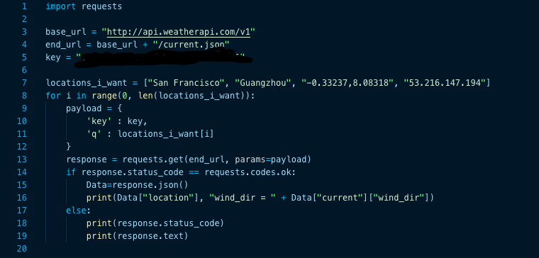
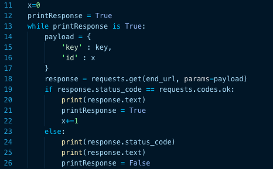
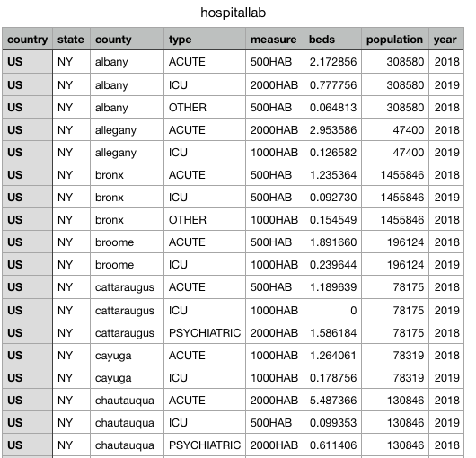
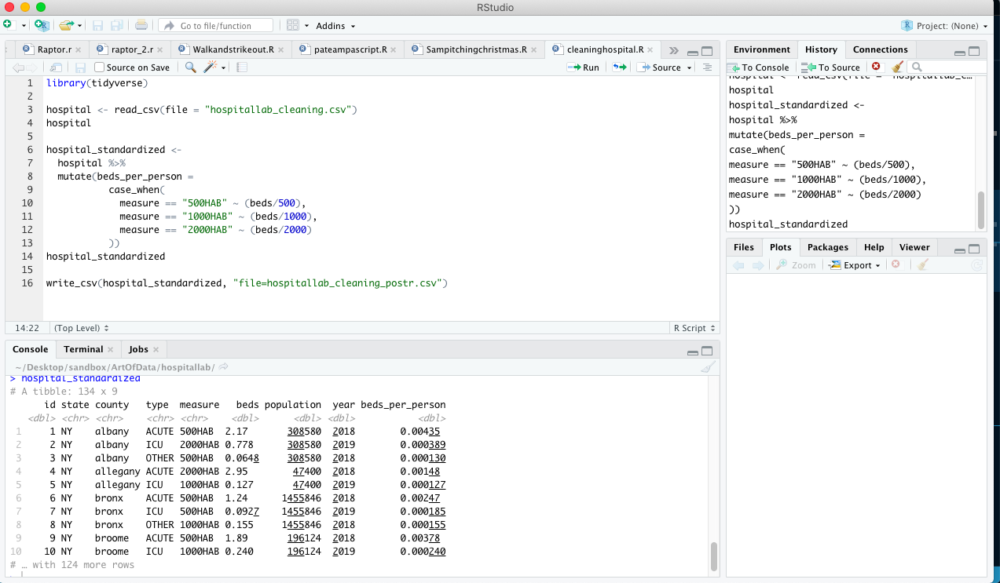
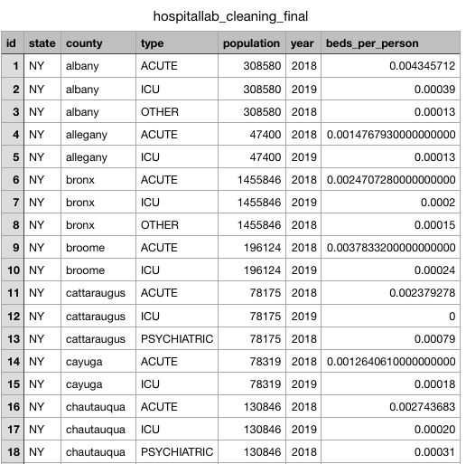
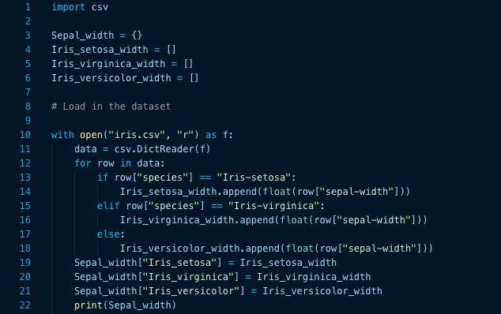
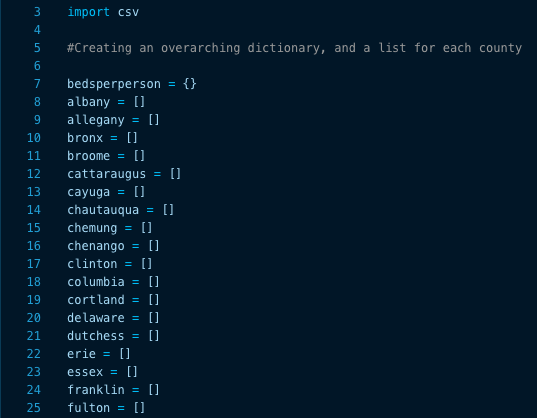
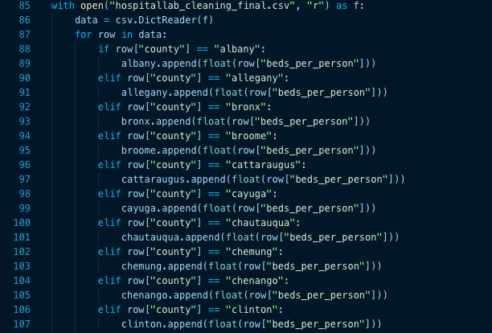
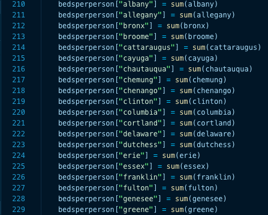
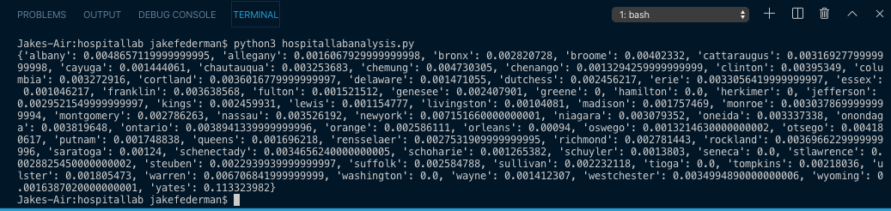

Quick note: all footnoted images are located at the end of this post.

## Using APIs

My favorite thing about baseball data is that a lot of it is readily available, accessible, and usable on the internet at all times. I love going to [Fangraphs](https://www.fangraphs.com) or [Baseball Savant](https://www.baseballsavant.mlb.com), pressing download as CSV, and then being done with data collection. However, most of the time, the data will not be sitting pretty right before your eyes. Often, it will be accesible through an API, meaning one must query a server to obtain it. APIs may seem intimidating and unneccesary at first, but once one understands how to use them, they can actually become relatively easy ways to get data. In this lab, we were tasked with using an API that our teacher Mr. Lee created to access data about the capacity of New York hospitals, and our mission was to determine which county had the most hospital beds per person.

## Step 1: Getting the data from the API

My main strategy in figuring out how to obtain the data from the API was to use what I had learned from our past assignment in which we used an API to get weather data[^1]. So, I started by copying and pasting my code from that assignment, and then adjusted it so it would query the hospital API, not the weather one. In office hours with Mr. Lee, Chandler, and Anthony, I was able to access the API through my browser by typing in a similar link to the what would allow me to access the weather API through my browser, and we realized that the data format was plain text, not a dictionary[^2]. So, instead of making the response a JSON, I made it text by using _response.text_. 
My biggest obstacle in this step was figuring out how to query every row at once and not just a single row. My typical strategy of using a for loop to cycle through every index wouldn't work because I didn't know how many rows were in the dataset. So, after a long time of re-learning the syntax for while loops, I eventually figured it out. I initialized x=0, then initialized a boolean that essentially told me if there was an error, and basically told the computer to query the server for each number row until I get an invalid index error[^3]. Then I utilized the pipe in terminal to export this output to a CSV[^4].

## Cleaning the Data

I did four separate things to clean the data. First, I changed the name of the primary key column from country to id, and I changed the values within that column to numbers 1-136. The reasoning behind this action was I wanted a primary key that was actually useful, specifically one that would allow me to identify individual rows in the dataset. Then, I noticed I had two extra rows as a result of the way I structured my while loop, so I deleted them. The third step was definetly the most complicated one. In the original CSV, the bed data was not standardized, as some counties were shown in beds per 500 people, others in beds per 1000 people, and the rest in beds per 2000 people. To standardize all of these under the same unit, beds per person, I used functions in the tidyverse, an enourmous library in RStudio. Using RStudio[^5] for this aspect was actually pretty simple, as the only functions I had to call upon were *mutate* and *case_when*, which are two of the five most basic functions in the entire tidyverse. Mutate allows one to add a new category, and case_when essentially serves as an if/else function. My [lectures from Wharton Moneyball Academy](https://skdeshpande91.github.io/wharton_moneyball/lecture2.html) were helpful in refreshing my memory as to using these functions. Once the beds were standardized I brought the data back into Numbers, and removed the columns for the unstandardized bed numbers, as they were no longer necessary[^6].

## Reading in the CSV and analyzing the data

Now with a clean dataset, it is time to bring the data back into Python to analyze it and answer our question of which county has the most beds per person. My strategy was to do exactly what I had done for the Iris lab[^7] ([which I wrote about previously](https://jakefed1.github.io/2020-10-09-understandingirises/)), as the task was very similar. However, this time, hard-coding everything was a lot more tedious, as I had to create and use dozens of lists as opposed to just a few. After creating a single overarching dictionary called bedsperperson and a list for every county[^8], I began reading in the data. For each row, I made the computer append the beds per person value to that county's list[^9]. Then, I appended the sum of each county's list[^10] to the big bedsperperson dictionary, and then printed that dictionary[^11]. It turns out that New York county has the highest number of beds per person at just over 0.007 beds per person.

## Footnoted images
1. My code for the weather API assignment 
2. Text output from querying the server through my browser 
3. My while loop for querying the server 
4. What the original CSV looked like 
5. My code in RStudio and the output 
6. What the final cleaned CSV looked like 
7. Code from the Iris lab 
8. Initializing like a half a zillion lists 
9. Appending lots of lists as I loaded in the data 
10. Summing each list and putting it in the big dictionary 
11. Terminal output after reading in the CSV 