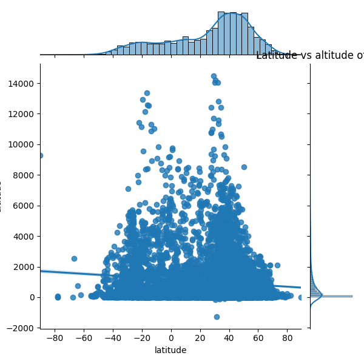

Millions of people use thousands of airports around the world every year. These transportation hubs are crucial to society, as they allow for the quick flow of humans, supplies, and ideas between cities and even countries. Here, I will use data to answer some questions that I had about the airports of the world.  
To answer my questions, I used data from [Openflights](https://openflights.org), and then employed the pandas, matplotlib, and seaborn packages in Python to analyze it. After downloading the csv and converting the data to a dataframe, I began graphing. First, I asked what is the distribution of altitudes of airports around the world? To answer this, I graphed the altitudes in a histogram, and found a very interesting result.  
  

The distribution is heavily skewed right, as there is a large tail on the right side of the data. If that wasn't enough evidence, the mean is significantly greater than the median, as the mean altitude is 1015 feet and the median altitude is 352 feet. The vast majority of the airports are located at altitudes between 0 and 2000 feet, with a few airports sitting a bit below 0 and a few airports at different altitudes between 2000 and 14000 feet.  
The next question I set out to answer was do either latitude or longitude correlate with altitude? To do this, I plotted a jointplot (scatterplot that also shows histograms for each variable) of latitude vs altitude and then longitude vs altitude.  
  
  

While neither latitude nor longitude correlated with altitude, this finding shouldn't be surprising, as there was no reason for us to believe there should be a correlation in the first place. The more interesting findings actually come from the histograms of latitude and longitude on the top of their graphs respectively. The distribution of latitude is skewed left, with the most values coming in between latitudes of 30 and 60. The longitude distribution is actually trimodal. Additionally, there are two deep troughs, one before the first peak, and another between the first and second peaks. These dips make sense, as they exist at longitudes in the center of oceans, and we already know there are no airports in the middle of the ocean.  

Finally, I wanted to see which country had the most airports. To do this, I made a bar graph of all the countries showing how many airports they each have.  
  
Most countries have don't have particularly many airports, but a few countries have over 100 airports. However, the United States has the most airports by a very large amount, with over 1400 airports.